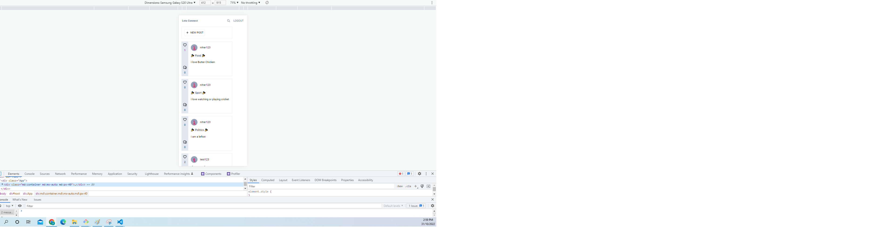
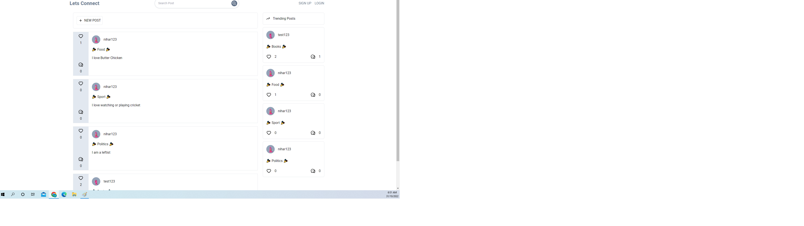
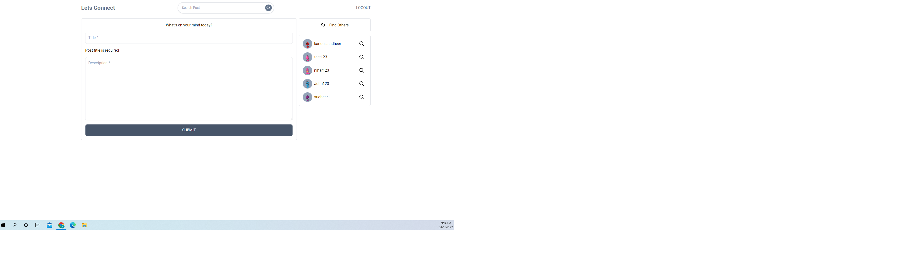
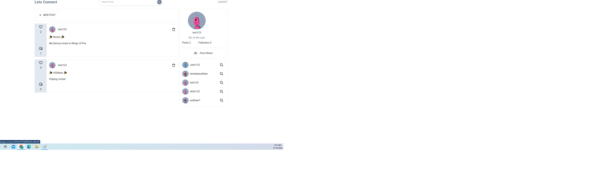
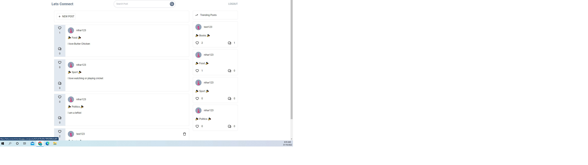
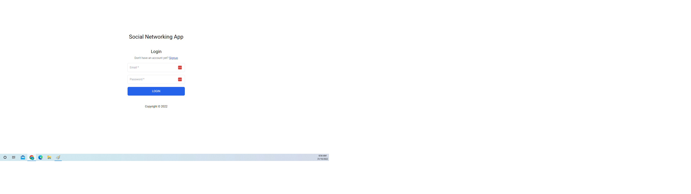
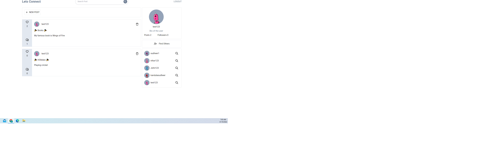
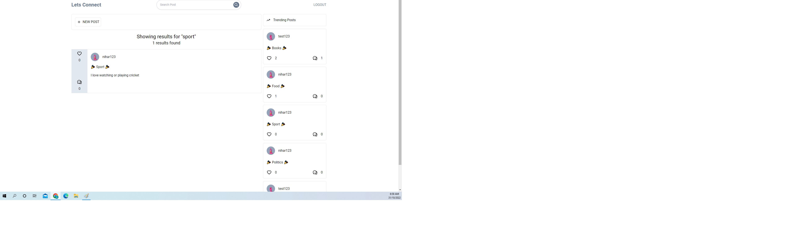
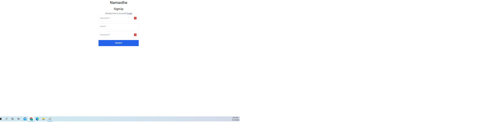
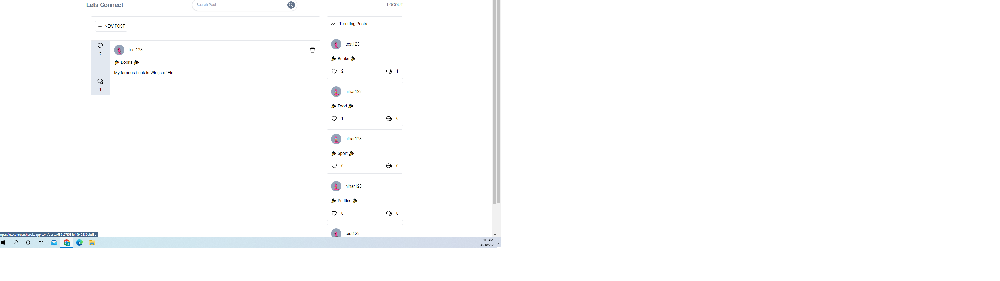

# Let's Connect (a Social Networking Blog)

## My task

My task is to build a Full stack apllication using MERN stack.

## User Story

```md
As a Full Stack Developer I would like to develop a develop a Social Networking Blog Using MERN Stack
A Web Application built to develop a Social Networking Blog where users can interact with their family friends and so on.
In this app users can register and will be able to create a post and react to someone else post aswell. They can also like or dislike others post. They can also follow other users of their interest
```

## Technologies Used

Front-End:React CSS: Tail-Wind</br>
Back-end: Node, MongoDB, Experss, Apollo Server and GraphQl

## Installation

In order to be able to run the app after being cloned you need to run, using node

```
npm i
```

Once node is installed application can be started using :

```
npm run develop
```

## Live application link heroku

You can view the live application at:https://letsconnectt.herokuapp.com/

## GitHub

To visit our GitHub repository visit: https://github.com/sudheer313/social-networking-mern-app

### Repo

sudheer313/social-networking-mern-app

## Screenshots of Application

<br/>
<br/>
<br/>
<br/>
<br/>
<br/>
<br/>
<br/>
<br/>
<br/>


## References

https://www.freecodecamp.org/news/graphql-for-front-end-developers/<br/>
https://www.freecodecamp.org/news/learn-how-to-use-react-and-graphql-to-make-a-full-stack-social-network/<br/>
https://www.youtube.com/watch?v=n1mdAPFq2Os<br/>
https://github.com/ihtasham42/social-media-app<br/>
https://tailwindui.com/documentation

## Challanges

It was very tough decision to work solo and I had to figure out my final MVP structure first and need to practice class tutorials and assignments to figure out a way to develop a MERN Stack application. Time played a crucial role developing this application.

## success

I was able to develop a MVP(minimum viable product) where users can signup, log in , Post their veiws and delete aswell.<br/>
I was able to learn GraphQL, React and also Tailwind CSS. <br/>

I feel very happy and confident after developing this application.

##

I would like to

## Contributor

Sudheer Kandula
